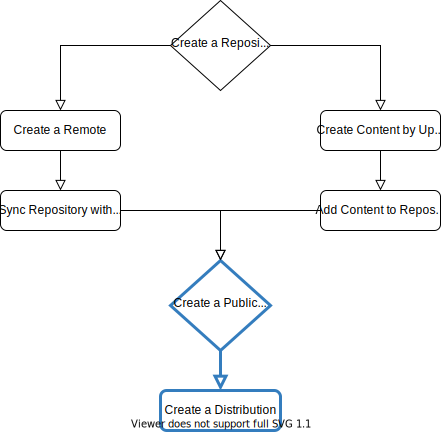

# Hosting APT Repositories



However you have obtained your Pulp repository content, you must publish and distribute it for it to become accessible on your Pulp instance.


## Basic Workflow

Once you have obtained some `pulp_deb` content, either via [sync](https://staging-docs.pulpproject.org/pulp_deb/docs/user/guides/sync/) or [upload](https://staging-docs.pulpproject.org/pulp_deb/docs/user/guids/upload/), that content must then be published and distributed so as to be available for clients.
The most basic version of this workflow is always the same, and all you need is the name of the relevant Pulp repository:

```bash
pulp deb repository list
NAME=my-repository  # Insert some repository name from the list here.
pulp deb publication create --repository=${NAME}
pulp deb distribution create --name=${NAME} --base-path=${NAME} --repository=${NAME}
```

Creating the distribution will return the `base_url` in the API response, which will contain the URL to your hosted repository.
The `base_url` has the following structure:

```none
<CONTENT_ORIGIN><CONTENT_PATH_PREFIX><distribution_base_path>
```

- `CONTENT_ORIGIN` is a required pulpcore setting, containing the protocol, fqdn, and port where the content app is reachable. See also the [pulpcore settings documentation](https://staging-docs.pulpproject.org/pulpcore/docs/admin/learn/settings/#pulp-settings).
- `CONTENT_PATH_PREFIX` is a optional pulpcore setting that defaults to `/pulp/content/`.
- The distribution base path is what you have supplied to the `--base-path` flag in the above example. In the examples in this documentation, we generally just use the repository name for the base path as well, but you may want to depart from that convention.

An example `base_url` could be:

```none
http://my-pulp-instance.com:5001/pulp/content/my-repository/
```


## Metadata Signing

!!! attention
    This workflow assumes you have already created a signing service of type `AptReleaseSigningService`.
    See the workflow on [signing service creation](https://staging-docs.pulpproject.org/pulp_deb/docs/user/guides/signing_service/) for how to do this.


Once you have created a signing service you can create signed publications from any repository:

```bash
pulp deb repository list
NAME=my-repository  # Insert some repository name from the list here.
pulp signing-service list
SIGNING_SERVICE_NAME=my-apt-release-signing-service  # Insert a signing service from the list.
pulp deb publication create --repository=${NAME} --signing-service=${SIGNING_SERVICE_NAME}
pulp deb distribution create --name=${NAME} --base-path=${NAME} --repository=${NAME}
```

The above example, will sign every distribution in your publication using the same signing service, and you will need to explicitly specify the signing service each time you create the publication.

You can also create a permanent link between a repository and a signing service using the `signing_service` parameter on your repository.
At the time of this writing, this cannot be done via Pulp CLI.

It is also possible to use the `signing_service_release_overrides` parameter to specify different signing services for different distributions within a single repository.
This parameter expects a dict of key-value pairs of the form `{"<distribution>": "<signing_service_href>"}`.
At the time of this writing, this cannot be done via Pulp CLI.

## Verbatim Publications

!!! attention
    For an explanation on what a verbatim publication is, see the corresponding [feature overview](https://staging-docs.pulpproject.org/pulp_deb/docs/user/overview).


The following example uses a verbatim publication to host an official Debian repository, including the installer files:

```bash
NAME='debian-installer-bookworm-amd64'
PULP_URL='http://localhost:5001'
REMOTE_OPTIONS=(
  name=${NAME}
  url=http://ftp.de.debian.org/debian/
  distributions=bookworm
  architectures=amd64
  sync_udebs=true
  sync_installer=true
)
http ${PULP_URL}/pulp/api/v3/remotes/deb/apt/ ${REMOTE_OPTIONS[@]}
pulp deb repository create --name=${NAME} --remote=${NAME}
pulp deb repository sync --name=${NAME}
pulp deb publication --type=verbatim create --repository=${NAME}
pulp deb distribution create --name=${NAME} --base-path=${NAME} --repository=${NAME}
```

As you can see, we had to create the remote using `http`, since Pulp CLI does not currently support the `sync_udebs` and `sync_installer` flags.
The only other addition was to add `--type=verbatim` to the `publication` command.

!!! warning
    Installing from synced content, as published above, is currently an [experimental feature](https://staging-docs.pulpproject.org/pulp_deb/docs/user/overview#installing-from-synced-content).


## Simple Publishing

It is possible to create `pulp_deb` repositories, that contain `.deb` packages, without any associated structure content.
Using the standard APT publisher, such packages are not included in the repo metadata.
By extension they are not part of the published repository as far as any consuming clients are concerned.
We recommend to stick to the workflows presented in this documentation, which ensure the creation of structured content.
However, as an alternate workaround, you can set the `--simple` flag when creating your publication:

```bash
pulp deb publication create --simple --no-structured --repository=${NAME}
```

The `--simple` flag causes an additional distribution named `default` with a single component named `all` to be added to your publication.
As the name suggests, this distribution-component combination, will simply contain all `.deb` packages from the repository, regardless of any structure content.
If you omit the `--no-structured` flag, the `default/all` distribution-component combination will be added *in addition* to the usual structured distribution-componen combinations.
