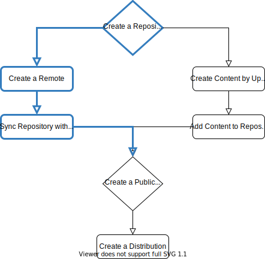

Synchronize a Repository
================================================================================

.. include:: ../external_references.rst

Users can populate their repositories with content from an external source by syncing their repository.

This example syncs the nginx repository from `nginx.org`_ for Debian Buster.

.. _create_a_repository:

Create a Repository
--------------------------------------------------------------------------------

Start by creating a new repository named ``nginx``:

.. code-block:: bash

   http post $BASE_ADDR/pulp/api/v3/repositories/deb/apt/ name="nginx"

This will return a ``201 Created`` response:

.. code-block:: json

   {
       "description": null,
       "latest_version_href": "/pulp/api/v3/repositories/deb/apt/1c8734dd-d4cb-4c2f-811a-87235f786444/versions/0/",
       "name": "nginx",
       "pulp_created": "2020-06-29T07:17:34.789398Z",
       "pulp_href": "/pulp/api/v3/repositories/deb/apt/1c8734dd-d4cb-4c2f-811a-87235f786444/",
       "versions_href": "/pulp/api/v3/repositories/deb/apt/1c8734dd-d4cb-4c2f-811a-87235f786444/versions/"
   }

Create a Remote
--------------------------------------------------------------------------------

Creating a remote object informs Pulp about an external content source:

.. code-block:: bash

   http post $BASE_ADDR/pulp/api/v3/remotes/deb/apt/ name="nginx.org" url="http://nginx.org/packages/debian" distributions="buster"

This will return a ``201 Created`` response:

.. code-block:: json

   {
       "architectures": null,
       "ca_cert": null,
       "client_cert": null,
       "client_key": null,
       "components": null,
       "distributions": "buster",
       "download_concurrency": 20,
       "gpgkey": null,
       "name": "nginx.org",
       "password": null,
       "policy": "immediate",
       "proxy_url": null,
       "pulp_created": "2020-06-29T07:18:44.906572Z",
       "pulp_href": "/pulp/api/v3/remotes/deb/apt/efd3848c-6d7b-4f25-baaf-ad05b52a5220/",
       "pulp_last_updated": "2020-06-29T07:18:44.906584Z",
       "sync_installer": false,
       "sync_sources": false,
       "sync_udebs": false,
       "tls_validation": true,
       "url": "http://nginx.org/packages/debian",
       "username": null
   }

Sync Repository with Remote
--------------------------------------------------------------------------------

Use a repository with a specified remote object to start the synchronization process.
This is telling Pulp to fetch content from the remote and add it to the repository.
The remote is the parameter to the sync endpoint on the repository.

.. code-block:: bash

   http post $BASE_ADDR/pulp/api/v3/repositories/deb/apt/<uuid_repository>/sync/ remote=$BASE_ADDR/pulp/api/v3/remotes/deb/apt/<uuid_remote>/

Replace the ``uuid`` of the repository as returned by step one and replace the ``uuid`` of the remote as returned by step two.

This will return a ``202 Accepted`` response:

.. code-block:: json

   {
       "task": "/pulp/api/v3/tasks/c3a75b6c-97c9-410b-b079-a7a70ebae0cb/"
   }

Depending on the size of the repository, this might take a while.

You can follow the progress of the task with a ``GET`` request to the task:

.. code-block:: bash

   http get $BASE_ADDR/pulp/api/v3/tasks/c3a75b6c-97c9-410b-b079-a7a70ebae0cb/

This will return a ``200 OK`` response:

.. code-block:: json

   {
         "child_tasks": [],
         "created_resources": [
             "/pulp/api/v3/repositories/deb/apt/1381e6e4-135f-49dd-8e1d-5336c475fe92/versions/1/"
         ],
         "error": null,
         "finished_at": "2020-06-26T06:58:54.913964Z",
         "name": "pulp_deb.app.tasks.synchronizing.synchronize",
         "parent_task": null,
         "progress_reports": [
             {
                 "code": "downloading.artifacts",
                 "done": 125,
                 "message": "Downloading Artifacts",
                 "state": "completed",
                 "suffix": null,
                 "total": null
             },
             {
                 "code": "update.release_file",
                 "done": 1,
                 "message": "Update ReleaseFile units",
                 "state": "completed",
                 "suffix": null,
                 "total": null
             },
             {
                 "code": "update.packageindex",
                 "done": 2,
                 "message": "Update PackageIndex units",
                 "state": "completed",
                 "suffix": null,
                 "total": null
             },
             {
                 "code": "associating.content",
                 "done": 229,
                 "message": "Associating Content",
                 "state": "completed",
                 "suffix": null,
                 "total": null
             }
         ],
         "pulp_created": "2020-06-26T06:58:35.505839Z",
         "pulp_href": "/pulp/api/v3/tasks/b280c885-d9f9-4155-b7e1-e7fe87649f10/",
         "reserved_resources_record": [
             "/pulp/api/v3/remotes/deb/apt/73492e70-c9a7-4a34-92ae-ce16bb69e060/",
             "/pulp/api/v3/repositories/deb/apt/1381e6e4-135f-49dd-8e1d-5336c475fe92/"
         ],
         "started_at": "2020-06-26T06:58:35.665451Z",
         "state": "completed",
         "task_group": null,
         "worker": "/pulp/api/v3/workers/e64b7bf5-90a0-439a-a4f2-bc1a5c0f6942/"
   }

Notice that when the synchronize task completes, it creates a new version, which is specified in ``created_resources``.

Continue with :doc:`publish` to make your synced repository consumable.
