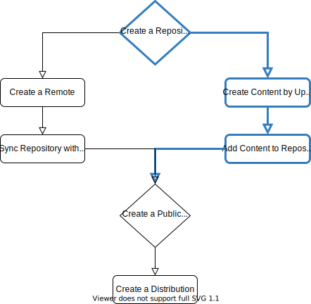

.. _upload_and_manage_content:

Upload and Manage Content
================================================================================

To manually upload a package to Pulp, this assumes you to already have a :ref:`repository created <create_a_repository>`.

List all existing repositories by running the following command:

.. code-block:: bash

   http get $BASE_ADDR/pulp/api/v3/repositories/deb/apt/

This will return a ``200 OK`` response:

.. code-block:: json

   {
       "count": 1,
       "next": null,
       "previous": null,
       "results": [
           {
               "description": null,
               "latest_version_href": "/pulp/api/v3/repositories/deb/apt/ff14907e-d1c5-4bac-b8d6-4c534575ed41/versions/0/",
               "name": "vim",
               "pulp_created": "2020-06-29T13:41:29.281602Z",
               "pulp_href": "/pulp/api/v3/repositories/deb/apt/ff14907e-d1c5-4bac-b8d6-4c534575ed41/",
               "versions_href": "/pulp/api/v3/repositories/deb/apt/ff14907e-d1c5-4bac-b8d6-4c534575ed41/versions/"
           }
       ]
   }

You will need the value of ``pulp_href`` of the repository you want to add a package to.

Create Content by Uploading a File
--------------------------------------------------------------------------------

You can directly upload a file to the ``content`` API endpoint:

.. code-block:: bash

   http --form post $BASE_ADDR/pulp/api/v3/content/deb/packages/ file@"./vim_8.2.0716-3_arm64.deb"

.. note::

   It is strongly recommended to omit the ``relative_path`` and have Pulp generate a common pool location.
   This will be ``pool/v/vim/vim_2:8.2.0716-3_arm64.deb`` as shown below.

   When specifying a ``relative_path``, make sure to add the exact name of the package including its version as you'd get via ``dpkg-deb -I vim_8.2.0716-3_arm64.deb``.
   It is composed of the *package name*, an *underscore*, and its *version*:

   .. code-block:: none

      relative_path="any/arbitrary/location/vim_2:8.2.0716-3_arm64.deb"

This will return a ``202 Accepted`` response:

.. code-block:: json

   {
       "task": "/pulp/api/v3/tasks/5cc88067-f03c-4f7b-bda8-f193755a8aa5/"
   }

Run the following command to view the status of the task:

.. code-block:: bash

   http get $BASE_ADDR/pulp/api/v3/tasks/5cc88067-f03c-4f7b-bda8-f193755a8aa5/

This will return a ``200 OK`` response:

.. code-block:: json

   {
       "child_tasks": [],
       "created_resources": [
           "/pulp/api/v3/content/deb/packages/1eeabd4d-48b3-433e-9732-ce1b56cc9bb9/"
       ],
       "error": null,
       "finished_at": "2020-06-29T07:40:53.307389Z",
       "name": "pulpcore.app.tasks.base.general_create",
       "parent_task": null,
       "progress_reports": [],
       "pulp_created": "2020-06-29T07:40:53.113349Z",
       "pulp_href": "/pulp/api/v3/tasks/5cc88067-f03c-4f7b-bda8-f193755a8aa5/",
       "reserved_resources_record": [
           "/pulp/api/v3/artifacts/613e4817-6a3a-4f7f-8404-49ffe0085290/"
       ],
       "started_at": "2020-06-29T07:40:53.218540Z",
       "state": "completed",
       "task_group": null,
       "worker": "/pulp/api/v3/workers/50a13e76-fe27-4e3e-8cee-ae5ec41d272a/"
   }

.. note::

   Alternatively, you can upload an artifact to the ``artifacts`` API endpoint and then create a content unit of type ``deb`` from the exisiting artifact.

   1. Upload a file to the ``artifacts`` endpoint

      .. code-block:: bash

         http --form post $BASE_ADDR/pulp/api/v3/artifacts/ file@"./vim_8.2.0716-3_amd64.deb"

   2. Create Content from an exisiting artifact

      .. code-block:: bash

         http post $BASE_ADDR/pulp/api/v3/content/deb/packages/ artifact=/pulp/api/v3/artifacts/<uuid>/

Add Content to Repository
--------------------------------------------------------------------------------

View the list of packages:

.. code-block:: bash

   http get $BASE_ADDR/pulp/api/v3/content/deb/packages/

This will return the necessary ``uuid`` for the following step, which is identical to the ``created_resources`` from querying the task above.

Once there is a content unit, it can be added to and removed from repositories.
This example adds the *arm* version of vim:

.. code-block:: bash

   http post $BASE_ADDR/pulp/api/v3/repositories/deb/apt/250083a4-8eaa-42b6-a588-c48c2a2935f0/modify/ add_content_units:="[\"http://localhost:24817/pulp/api/v3/content/deb/packages/1eeabd4d-48b3-433e-9732-ce1b56cc9bb9/\"]"

This will return a ``202 Accepted`` response:

.. code-block:: json

   {
       "task": "/pulp/api/v3/tasks/ed0dfef8-7e5d-44a1-8f2b-7f7f29aae0dd/"
   }

View the task by running the following command:

.. code-block:: bash

   http get $BASE_ADDR/pulp/api/v3/tasks/ed0dfef8-7e5d-44a1-8f2b-7f7f29aae0dd/

This will return a ``200 OK`` response:

.. code-block:: json

   {
       "child_tasks": [],
       "created_resources": [
           "/pulp/api/v3/repositories/deb/apt/250083a4-8eaa-42b6-a588-c48c2a2935f0/versions/1/"
       ],
       "error": null,
       "finished_at": "2020-06-29T07:47:50.816567Z",
       "name": "pulpcore.app.tasks.repository.add_and_remove",
       "parent_task": null,
       "progress_reports": [],
       "pulp_created": "2020-06-29T07:47:50.686844Z",
       "pulp_href": "/pulp/api/v3/tasks/ed0dfef8-7e5d-44a1-8f2b-7f7f29aae0dd/",
       "reserved_resources_record": [
           "/pulp/api/v3/repositories/deb/apt/250083a4-8eaa-42b6-a588-c48c2a2935f0/"
       ],
       "started_at": "2020-06-29T07:47:50.778375Z",
       "state": "completed",
       "task_group": null,
       "worker": "/pulp/api/v3/workers/50a13e76-fe27-4e3e-8cee-ae5ec41d272a/"
   }

Go to :ref:`publish <publish>` to make your repository consumable.
